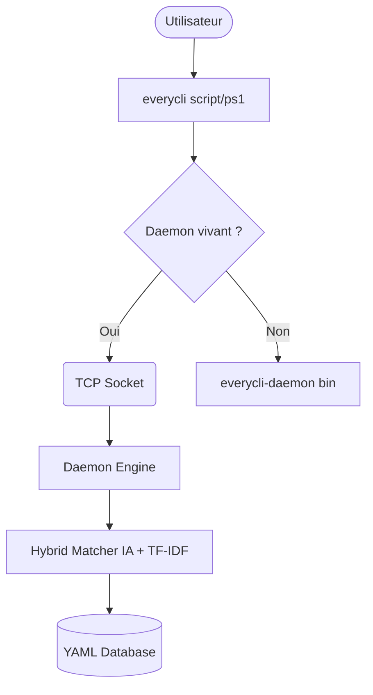

# 🚀 EveryCli

**Ne cherchez plus vos commandes, décrivez-les.**

EveryCli est un assistant de ligne de commande intelligent qui utilise l'IA pour trouver instantanément la commande exacte dont vous avez besoin, même si vous ne connaissez pas sa syntaxe.


## ✨ Caractéristiques

- **Recherche Sémantique** : Comprend l'intention (ex: "annuler commit" → `git reset HEAD~1`).
- **Performance Instantanée** : Architecture Daemon/Client pour des réponses en <50ms.
- **Multi-Plateforme** : Binaires optimisés pour Linux, macOS et Windows.
- **Zéro Dépendance** : Pas besoin d'installer Python ou des modèles IA pour l'utiliser.
- **Extensible** : Ajoutez vos propres commandes via de simples fichiers YAML.

## 🏁 Démarrage Rapide (Release)

1. Téléchargez le binaire pour votre OS sur la page [Releases](https://github.com/HE11032006/EveryCli/releases).
2. Installez le wrapper :
   ```bash
   # Linux / macOS
   sudo ln -s $(pwd)/everycli /usr/local/bin/everycli
   ```
3. Lancez votre première recherche :
   ```bash
   everycli search "comment modifier mon dernier commit"
   ```

## 🛠️ Installation pour Développement

Si vous souhaitez contribuer ou compiler depuis les sources :

```bash
git clone https://github.com/HE11032006/EveryCli.git
cd EveryCli
pip install -r requirements.txt
python3 -m everycli.everycli search "git push"
```

## 🏗️ Architecture

EveryCli utilise une architecture hybride pour concilier l'intelligence des modèles NLP et la réactivité attendue d'un outil CLI.



> [!IMPORTANT]
> Le premier lancement après un redémarrage démarre automatiquement le Daemon. Les recherches suivantes seront quasi-instantanées car le modèle IA reste chargé en mémoire.

## ⚙️ Configuration

Vous pouvez personnaliser EveryCli via des variables d'environnement :
- `EVERYCLI_PORT` : Port du daemon (défaut: 51821).
- `EVERYCLI_DEBUG` : Mode verbeux pour le dépannage.

---
*Fait avec ❤️ pour simplifier la vie des développeurs.*
